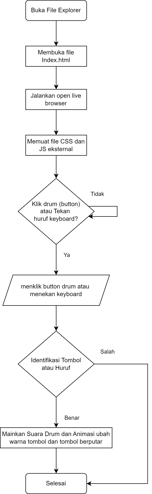

# Drum Kit

Drum kit interaktif berbasis web yang saya kembangkan memungkinkan pengguna untuk memainkan suara drum menggunakan klik mouse atau tombol keyboard.

# Flowchart Diagram

## Fitur

- Tombol drum interaktif
- Dukungan keyboard untuk memainkan drum
- Animasi saat drum diaktifkan

## Teknologi yang Digunakan

- HTML5
- CSS3
- JavaScript

## Cara Penggunaan

1. Clone repositori ini ke mesin lokal Anda.
   git clone https://github.com/raflytch/ch2-24-09-2024-js-challenge-drum.git
2. Buka file `index.html` di browser web Anda.
3. Klik pada tombol drum atau gunakan tombol keyboard yang sesuai untuk memainkan suara.

### Memainkan Drum

- Klik pada tombol drum dengan mouse Anda, atau
- Gunakan tombol keyboard berikut:
  - 'W': Tom 1
  - 'A': Tom 2
  - 'S': Tom 3
  - 'D': Tom 4
  - 'J': Snare
  - 'K': Crash
  - 'L': Kick Bass

## Struktur Proyek

- `index.html`: File HTML utama yang berisi struktur drum kit.
- `styles.css`: File CSS untuk styling antarmuka drum kit.
- `index.js`: File JavaScript yang berisi logika untuk pemutaran suara dan animasi.
- `sounds/`: Direktori yang berisi file suara drum (format MP3).

## Animasi

Ketika sebuah drum diaktifkan, akan:

- Berubah warna menjadi biru selama 3 detik
- Berputar 360 derajat selama 2 detik
